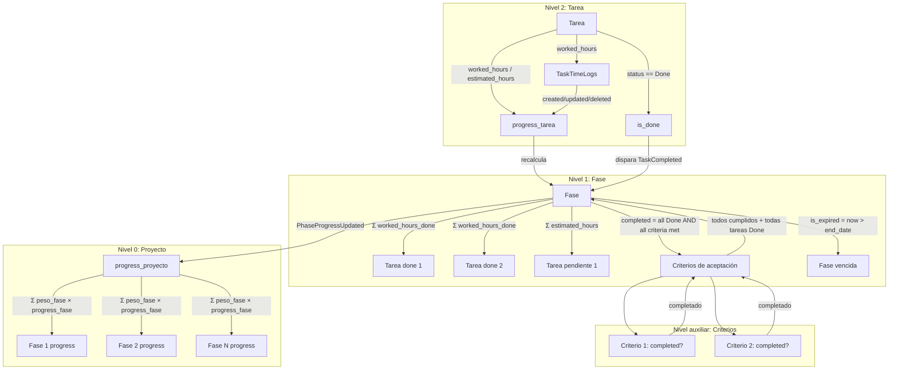
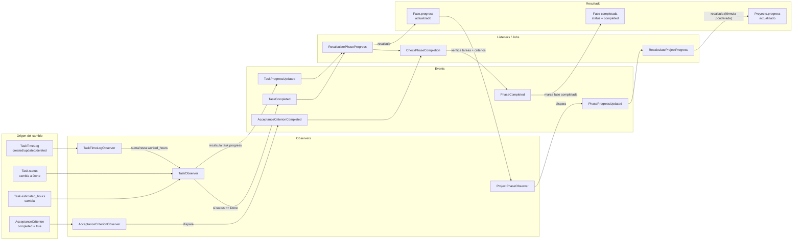
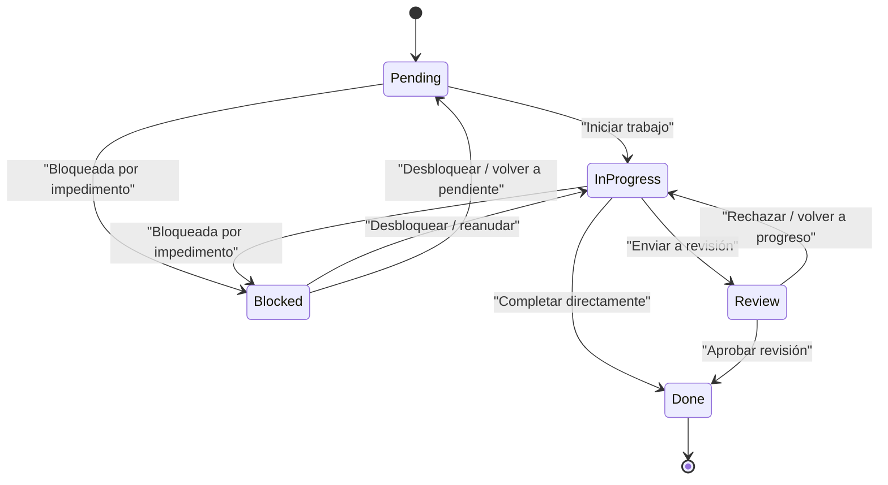
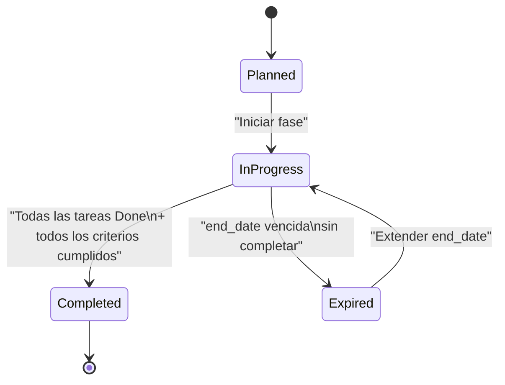
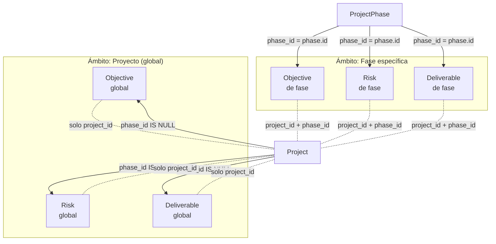

# Diagrama de Dominio — Módulo de Gestión de Proyectos

**Fecha:** 2026-06-16
**Versión:** 1.0
**Notación:** Mermaid (Entity Relationship Diagram)
**Propósito:** Representar gráficamente el modelo de dominio propuesto tras la refactorización.

---

## 1. Diagrama ER — Modelo de dominio completo

```mermaid
erDiagram
    Project ||--o{ ProjectPhase : "has phases"
    Project ||--o{ Task : "has tasks"
    Project ||--o{ Objective : "has global objectives"
    Project ||--o{ Risk : "has global risks"
    Project ||--o{ Deliverable : "has global deliverables"
    Project ||--o{ Milestone : "has milestones"
    Project ||--o{ Ticket : "has tickets"
    Project ||--o{ Blocker : "has blockers"
    Project ||--o{ ProjectMember : "has members"
    Project ||--|| ProjectMetric : "has metrics"
    Project }o--|| User : "owned by (owner_id)"

    ProjectPhase ||--o{ Task : "contains tasks"
    ProjectPhase ||--o{ AcceptanceCriterion : "has acceptance criteria"
    ProjectPhase ||--o{ Objective : "has phase objectives"
    ProjectPhase ||--o{ Risk : "has phase risks"
    ProjectPhase ||--o{ Deliverable : "has phase deliverables"

    Task ||--o{ TaskTimeLog : "has time logs"
    Task ||--o{ TaskComment : "has comments"
    Task ||--o{ Blocker : "is blocked by"
    Task }o--|| User : "assigned to"
    Task }o--|| User : "created by"

    Deliverable ||--o{ Deliverable : "parent → child dependency"
    Deliverable }o--|| User : "approved by"

    Risk }o--|| User : "reported by"

    ProjectMember }o--|| User : "belongs to user"

    AcceptanceCriterion {
        bigint id PK
        bigint phase_id FK "NOT NULL"
        text description
        boolean completed "DEFAULT FALSE"
        timestamp created_at
        timestamp updated_at
    }

    Project {
        bigint id PK
        bigint owner_id FK
        string name
        string code
        text description
        enum status "ProjectStatus"
        date start_date
        date end_date
        decimal budget
        tinyint progress "DERIVED"
        uuid uuid
        timestamp created_at
        timestamp updated_at
        timestamp deleted_at
    }

    ProjectPhase {
        bigint id PK
        bigint project_id FK
        string name
        date start_date
        date end_date
        tinyint progress "DERIVED"
        enum status "PhaseStatus (NUEVO)"
        timestamp completed_at "NUEVO"
        timestamp created_at
        timestamp updated_at
    }

    Task {
        bigint id PK
        bigint project_id FK
        bigint phase_id FK "nullable"
        bigint assigned_to FK "nullable"
        bigint created_by FK
        string title
        text description
        string priority "low|medium|high|critical"
        enum status "TaskStatus"
        datetime due_date
        int estimated_hours
        int worked_hours "DERIVED"
        tinyint progress "DERIVED"
        timestamp created_at
        timestamp updated_at
    }

    Objective {
        bigint id PK
        bigint project_id FK
        bigint phase_id FK "NUEVO nullable"
        enum type "ObjectiveType"
        string title
        text description
        boolean completed
        timestamp created_at
        timestamp updated_at
    }

    Risk {
        bigint id PK
        bigint project_id FK
        bigint phase_id FK "NUEVO nullable"
        bigint reported_by FK "NUEVO nullable"
        string title
        text description
        enum impact "RiskImpact"
        enum probability "RiskProbability"
        text mitigation_plan
        enum status "RiskStatus"
        timestamp created_at
        timestamp updated_at
    }

    Deliverable {
        bigint id PK
        bigint project_id FK
        bigint phase_id FK "NUEVO nullable"
        bigint parent_id FK "NUEVO nullable self-ref"
        bigint approved_by FK "NUEVO nullable"
        string name
        text description
        date delivery_date
        boolean approved
        timestamp created_at
        timestamp updated_at
    }

    Milestone {
        bigint id PK
        bigint project_id FK
        string title
        date target_date
        boolean completed
        timestamp created_at
        timestamp updated_at
    }

    TaskTimeLog {
        bigint id PK
        bigint task_id FK
        bigint user_id FK
        int hours
        string description
        timestamp logged_at
        timestamp created_at
        timestamp updated_at
    }

    TaskComment {
        bigint id PK
        bigint task_id FK
        bigint user_id FK
        text body
        timestamp created_at
        timestamp updated_at
    }

    Ticket {
        bigint id PK
        bigint project_id FK
        bigint created_by FK
        bigint assigned_to FK
        string title
        text description
        string priority
        enum status "TicketStatus"
        timestamp created_at
        timestamp updated_at
    }

    Blocker {
        bigint id PK
        bigint project_id FK
        bigint task_id FK
        bigint reported_by FK
        bigint resolved_by FK
        string title
        text description
        enum severity "BlockerSeverity"
        boolean resolved
        timestamp resolved_at
        timestamp created_at
        timestamp updated_at
    }

    User {
        bigint id PK
        string name
        string email
        string password
        timestamp role_changed_at
        timestamp created_at
        timestamp updated_at
    }

    ProjectMember {
        bigint id PK
        bigint project_id FK
        bigint user_id FK
        string role "ProjectMemberRole"
        timestamp created_at
        timestamp updated_at
    }

    ProjectMetric {
        bigint id PK
        bigint project_id FK
        int total_tasks
        int completed_tasks
        int open_tickets
        int total_blockers
        decimal completion_rate "DERIVED"
        timestamp created_at
        timestamp updated_at
    }
```

---

## 2. Diagrama jerárquico de avance (flujo de cálculo)

---

## 3. Diagrama de eventos y observers (flujo de recálculo automático)

---

## 4. Modelo de estados de tarea (TaskStatus)

---

## 5. Modelo de estados de fase (nuevo — PhaseStatus)

---

## 6. Relaciones polimórficas — Entidades vinculables a fase o proyecto

---

## 7. Notas del diagrama

- Los campos marcados como **"NUEVO"** en el ER son adiciones propuestas en la refactorización.
- Los campos marcados como **"DERIVED"** son calculados automáticamente vía observers/listeners; nunca deben ser escritos directamente por el frontend.
- Las relaciones `phase_id` en `objectives`, `risks` y `deliverables` son **nullable**. Un valor `null` significa que la entidad pertenece al proyecto en lugar de a una fase específica.
- La relación `parent_id` en `deliverables` es **self-referencing** (apunta a la misma tabla `deliverables`). Permite establecer una jerarquía de dependencias entre entregables.
- `AcceptanceCriterion` es una entidad nueva que no existe en el modelo actual. Se vincula obligatoriamente a `ProjectPhase` (`phase_id` NOT NULL).
- `TaskStatus` es un enum con transiciones controladas por el método `canTransitionTo()`.
- `PhaseStatus` (Planned → InProgress → Completed / Expired) es un enum nuevo propuesto para la refactorización.
