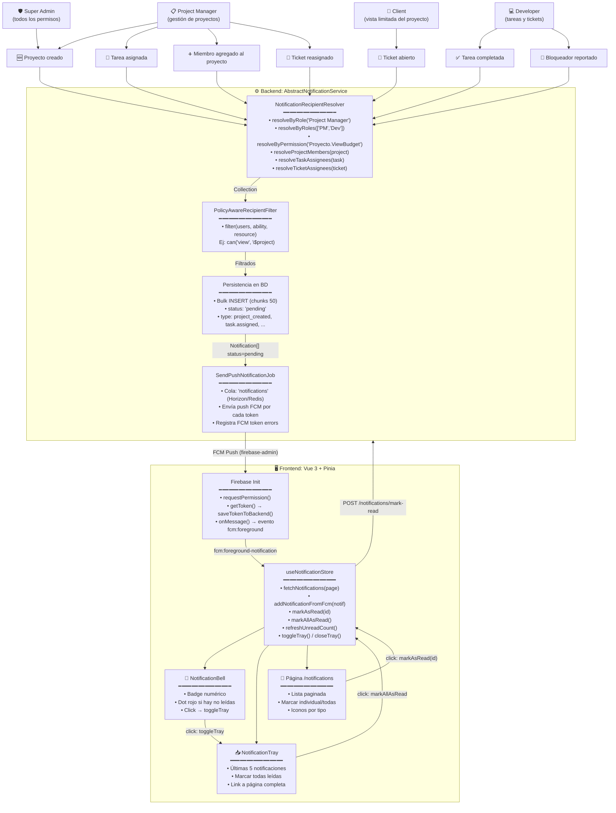
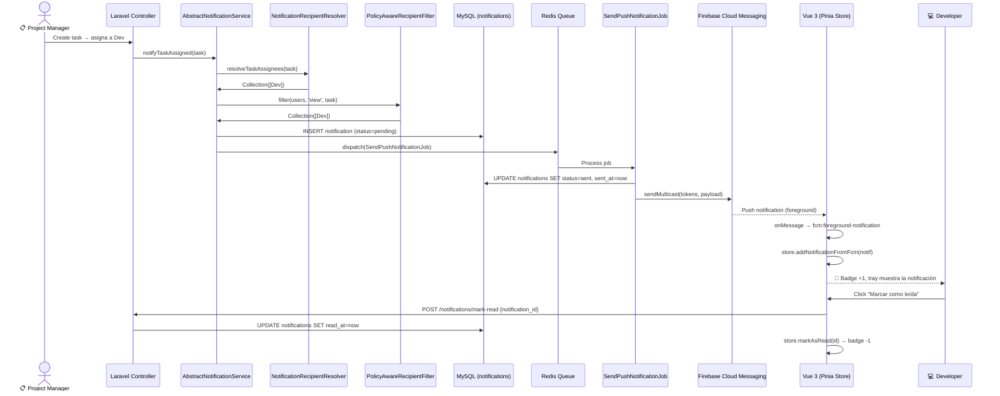
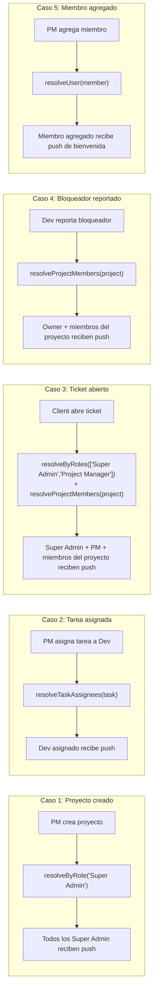
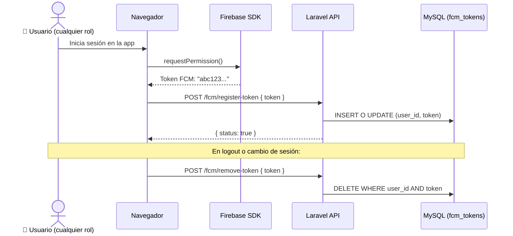

# 📬 Casos de Uso — Sistema de Notificaciones (FCM + Bandeja)



---

## 📋 Matriz Roles × Acciones de Notificación

| Acción | Super Admin | Project Manager | Developer | Client |
|---|---|---|---|---|
| **Recibir push FCM** | ✅ | ✅ | ✅ | ✅ |
| **Ver campanita con badge** | ✅ | ✅ | ✅ | ✅ |
| **Abrir bandeja (tray)** | ✅ | ✅ | ✅ | ✅ |
| **Marcar una como leída** | ✅ | ✅ | ✅ | ✅ |
| **Marcar todas como leídas** | ✅ | ✅ | ✅ | ✅ |
| **Ver historial paginado** | ✅ | ✅ | ✅ | ✅ |
| **Programar notificación** | ✅ | ✅ | ❌ | ❌ |
| **Gestionar tokens FCM** | ✅ | ✅ (propios) | ✅ (propios) | ✅ (propios) |

---

## 🔄 Flujo de Vida de una Notificación



---

## 🎯 Escenarios de Resolución de Destinatarios



---

## 📊 Estados de una Notificación

| Estado | Significado | Transiciones |
|---|---|---|
| `pending` | Persistida en BD, aún no enviada | → `sent` (job exitoso) |
| `sent` | FCM confirmó entrega | → `delivered` (dispositivo recibió) |
| `failed` | FCM rechazó o token inválido | — |
| `read` | Usuario marcó `read_at` | — |

---

## 🔐 Registro de Token FCM



---

## 🧹 Limpieza de Tokens Obsoletos

El comando `php artisan notifications:clean-stale-fcm-tokens` (programado en `scheduler`) elimina tokens que FCM reportó como inválidos después de múltiples intentos fallidos (`SendPushNotificationJob` registra los errores en `fcm_token_errors`).

```mermaid
graph TD
    JOB["SendPushNotificationJob"] -->|"FCM error: NOT_FOUND"| ERR["Registra en fcm_token_errors"]
    ERR --> CLEAN["CleanStaleFcmTokens<br/>(scheduler diario)"]
    CLEAN -->|"DELETE tokens con >3 errores"| DB["fcm_tokens"]
