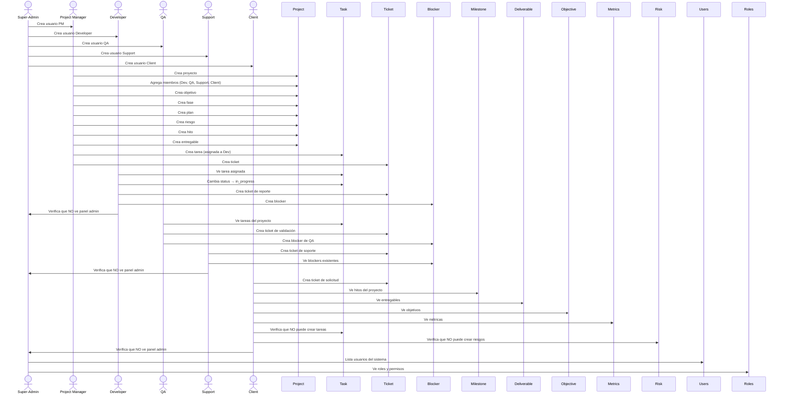
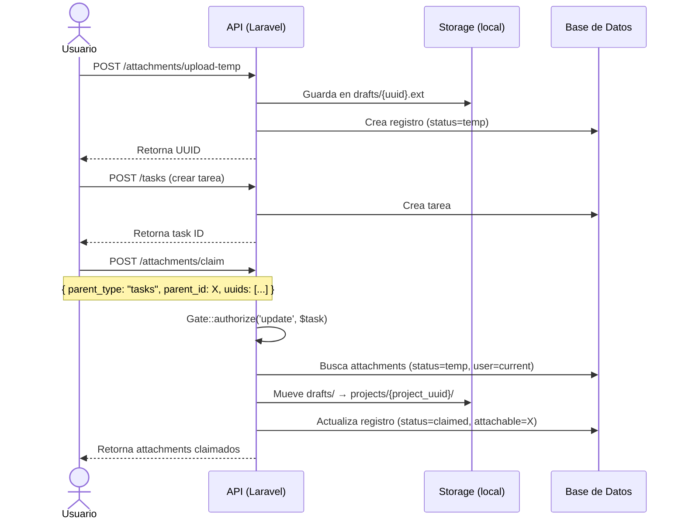
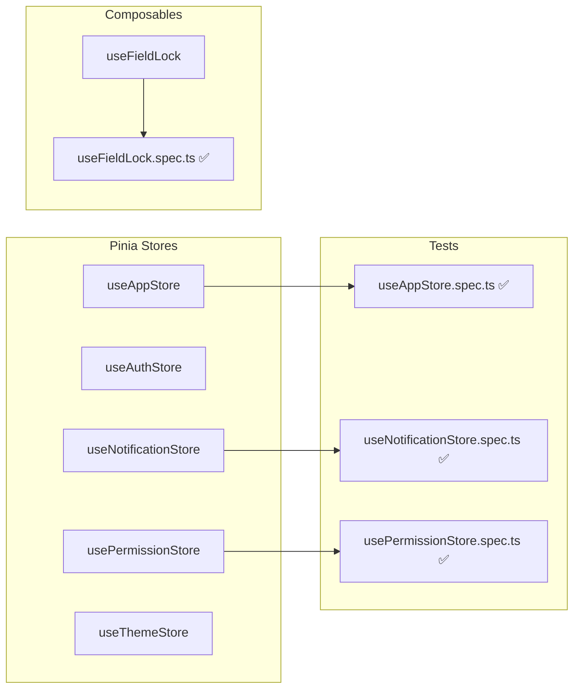
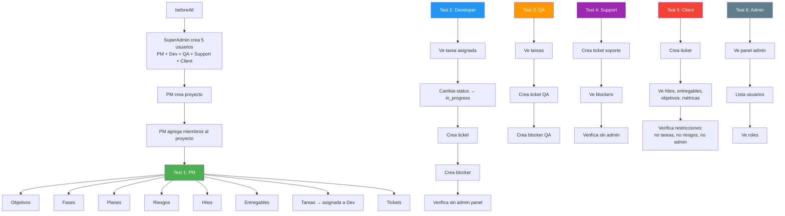
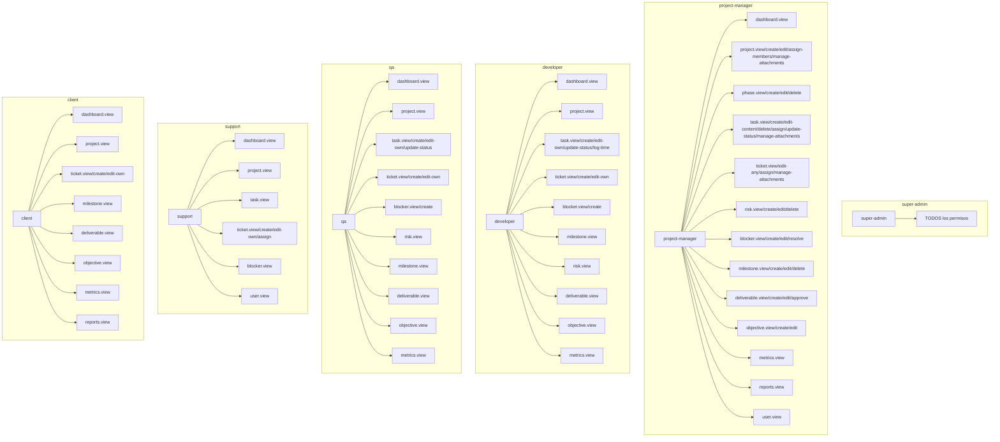

# Documentación de Testing — Gestión de Proyectos

**Fecha:** 2026-06-08  
**Versión:** 1.0  
**Rama base:** `main` (commit `767283b`)

---

## Índice

1. [Arquitectura de testing](#arquitectura-de-testing)
2. [Diagrama de flujo de interacción E2E](#diagrama-de-flujo-de-interacción-e2e)
3. [Tests unitarios (Vitest)](#tests-unitarios-vitest)
4. [Tests de integración (PHPUnit)](#tests-de-integración-phpunit)
5. [Tests E2E (Playwright)](#tests-e2e-playwright)
6. [Cómo ejecutar los tests](#cómo-ejecutar-los-tests)
7. [Permisos por rol](#permisos-por-rol)

---

## Arquitectura de testing

```
┌─────────────────────────────────────────────────────────┐
│                    TESTING PYRAMID                       │
├─────────────────────────────────────────────────────────┤
│                                                         │
│                    ┌───────────┐                         │
│                    │   E2E     │  ← Playwright           │
│                    │  6 tests  │     (navegador real)    │
│                    └─────┬─────┘                         │
│                          │                               │
│               ┌──────────┴──────────┐                    │
│               │    Integration      │  ← PHPUnit          │
│               │    88 tests         │     (HTTP + DB)     │
│               └──────────┬──────────┘                    │
│                          │                               │
│         ┌────────────────┴────────────────┐              │
│         │           Unit                   │  ← Vitest    │
│         │         135 tests                │     (JS/TS)  │
│         └─────────────────────────────────┘              │
│                                                         │
└─────────────────────────────────────────────────────────┘
```

| Capa | Framework | Ubicación | # Tests | Ejecución |
|------|-----------|-----------|---------|-----------|
| Unidad (Frontend) | Vitest | `frontend/src/__tests__/` | 135 | `npm run test` |
| Unidad (Backend) | PHPUnit | `backend/tests/Unit/` | 12 | `php artisan test --testsuite=Unit` |
| Integración (Backend) | PHPUnit | `backend/tests/Feature/` | 76 | `php artisan test --testsuite=Feature` |
| E2E | Playwright | `frontend/tests/e2e/` | 6 grupos | `npx playwright test --headed` |

---

## Diagrama de flujo de interacción E2E

### Flujo completo cross-role



### Flujo de autorización por rol

```mermaid
flowchart TD
    Login[Usuario hace login] --> RoleCheck{¿Qué rol tiene?}

    RoleCheck -->|super-admin| SA[Acceso total]
    RoleCheck -->|project-manager| PM[PM: Crear/editar/eliminar todo en su proyecto]
    RoleCheck -->|developer| DEV[Dev: Tareas asignadas, tickets propios, blockers]
    RoleCheck -->|qa| QA2[QA: Tareas asignadas, tickets, blockers]
    RoleCheck -->|support| SUP[Support: Tickets, asignación, blockers view]
    RoleCheck -->|client| CLI[Client: Tickets propios, hitos, entregables view]

    SA --> SA_ACTIONS[Ver admin panel<br/>Gestionar usuarios<br/>Ver roles]

    PM --> PM_ACTIONS[Crear proyecto<br/>Asignar miembros<br/>Objetivos/Fases/Planes<br/>Riesgos/Hitos/Entregables<br/>Tareas/Tickets]

    DEV --> DEV_ACTIONS[Ver tareas asignadas<br/>Cambiar status<br/>Log time<br/>Crear tickets/blockers]

    QA2 --> QA_ACTIONS[Ver tareas<br/>Cambiar status<br/>Crear tickets/blockers]

    SUP --> SUP_ACTIONS[Crear/asignar tickets<br/>Ver blockers]

    CLI --> CLI_ACTIONS[Crear tickets (solo Open)<br/>Ver hitos/entregables<br/>Ver objetivos/métricas]

    DEV_ACTIONS --> DEV_RESTRICT{¿Acción permitida?}
    QA_ACTIONS --> QA_RESTRICT{¿Acción permitida?}
    CLI_ACTIONS --> CLI_RESTRICT{¿Acción permitida?}

    DEV_RESTRICT -->|Crear proyecto| FORBIDDEN[403 Forbidden]
    DEV_RESTRICT -->|Editar tarea ajena| FORBIDDEN
    QA_RESTRICT -->|Crear proyecto| FORBIDDEN
    CLI_RESTRICT -->|Crear tarea| BUTTON_HIDDEN[Botón oculto en UI]
    CLI_RESTRICT -->|Crear riesgo| BUTTON_HIDDEN
    CLI_RESTRICT -->|Ver admin| MENU_HIDDEN[Menú no visible]
```

### Flujo del ciclo de vida de attachments



---

## Tests unitarios (Vitest)

### Archivos de test

| Archivo | Tests | Descripción |
|---------|-------|-------------|
| `useAppStore.spec.ts` | 5 | Snackbar y loader global |
| `useNotificationStore.spec.ts` | 22 | CRUD de notificaciones, FCM, bandeja |
| `usePermissionStore.spec.ts` | 6 | Carga, verificación, refresh, clear de permisos |
| `useAttachments.spec.ts` | 29 | Subida, descarga, reemplazo, eliminación de archivos |
| `useFieldLock.spec.ts` | 5 | Reactividad del field-locking, Proxy + computed |
| `useProjects.spec.ts` | 8 | Ciclo de vida de proyectos |
| `useTasks.spec.ts` | 4 | Ciclo de vida de tareas |
| `useTickets.spec.ts` | 6 | Ciclo de vida de tickets |
| `useMilestones.spec.ts` | 3 | Ciclo de vida de hitos |
| `useRisks.spec.ts` | 3 | Ciclo de vida de riesgos |
| `canAction.spec.ts` | 7 | Verificación de permisos (token, store, -own) |
| `auth.service.spec.ts` | 7 | Login, logout, me, register |
| `projects.service.spec.ts` | 12 | CRUD de proyectos |
| `tickets.service.spec.ts` | 7 | CRUD de tickets |
| `notifications.service.spec.ts` | 11 | API de notificaciones |

### Stores testeadas



---

## Tests de integración (PHPUnit)

### Estructura

```
backend/tests/
├── Feature/
│   ├── Attachment/
│   │   └── AttachmentClaimTest.php      # 3 tests — ciclo temp→claim
│   ├── Auth/
│   │   ├── AuthTest.php                 # 6 tests — login/logout/register
│   │   └── PermissionsFlowTest.php      # 4 tests — refresh, field_permissions
│   ├── Dashboard/
│   │   └── DashboardTest.php            # 5 tests — dashboard por rol
│   ├── Project/
│   │   ├── BlockerTest.php              # 5 tests
│   │   ├── DeliverableTest.php          # 4 tests
│   │   ├── MilestoneTest.php            # 3 tests
│   │   ├── ProjectMemberTest.php        # 4 tests
│   │   ├── ProjectScopedAccessTest.php  # 4 tests — scope cross-project
│   │   └── ProjectTest.php              # 6 tests
│   ├── Task/
│   │   ├── TaskCommentTest.php          # 3 tests
│   │   ├── TaskTest.php                 # 5 tests
│   │   └── TaskTimeLogTest.php          # 5 tests
│   ├── Ticket/
│   │   └── TicketTest.php               # 5 tests
│   └── User/
│       └── UserTest.php                 # 12 tests
└── Unit/
    ├── ExampleTest.php
    └── Notifications/
        ├── NotificationRecipientResolverTest.php  # 8 tests
        └── PolicyAwareRecipientFilterTest.php     # 4 tests
```

### Tests creados en esta refactorización

```mermaid
flowchart TD
    subgraph "Nuevos tests (11)"
        PSA[ProjectScopedAccessTest<br/>4 tests]
        PFT[PermissionsFlowTest<br/>4 tests]
        ACT[AttachmentClaimTest<br/>3 tests]
    end

    subgraph "Qué validan"
        PSA --> PSA1[No-miembro no puede ver tareas]
        PSA --> PSA2[Miembro sí puede ver tareas]
        PSA --> PSA3[Cross-project devuelve 404]
        PSA --> PSA4[Edición cross-project bloqueada]

        PFT --> PFT1[/me retorna permisos]
        PFT --> PFT2[/refresh-permissions funciona]
        PFT --> PFT3[No autenticado → 401]
        PFT --> PFT4[field_permissions en respuesta]

        ACT --> ACT1[Subida temp → claim → verificar]
        ACT --> ACT2[Otro user no puede claimear]
        ACT --> ACT3[No autenticado no puede subir]
    end
```

---

## Tests E2E (Playwright)

### Archivo único: `01-cross-role-lifecycle.spec.ts`



### Módulos cubiertos por rol

| Módulo | PM | Dev | QA | Support | Client | Admin |
|--------|:--:|:---:|:--:|:-------:|:------:|:-----:|
| Proyectos | ✅ C/E | ✅ V | ✅ V | ✅ V | ✅ V | ✅ V |
| Objetivos | ✅ C | ❌ | ❌ | ❌ | ✅ V | ❌ |
| Fases | ✅ C | ❌ | ❌ | ❌ | ❌ | ❌ |
| Planes | ✅ C | ❌ | ❌ | ❌ | ❌ | ❌ |
| Tareas | ✅ C/E | ✅ V/U | ✅ V | ❌ | ❌ V | ❌ |
| Tickets | ✅ C | ✅ C | ✅ C | ✅ C | ✅ C | ❌ |
| Riesgos | ✅ C | ❌ | ❌ | ❌ | ❌ V | ❌ |
| Bloqueadores | ✅ | ✅ C | ✅ C | ✅ V | ❌ | ❌ |
| Hitos | ✅ C | ✅ V | ❌ | ❌ | ✅ V | ❌ |
| Entregables | ✅ C | ✅ V | ❌ | ❌ | ✅ V | ❌ |
| Métricas | ✅ V | ✅ V | ❌ | ❌ | ✅ V | ❌ |
| Miembros | ✅ C/E | ❌ | ❌ | ❌ | ❌ | ❌ |
| Admin/Users | ❌ | ❌ V | ❌ V | ❌ V | ❌ V | ✅ |
| Roles | ❌ | ❌ V | ❌ V | ❌ V | ❌ V | ✅ |

> **Leyenda:** C = Create, E = Edit, V = View, U = Update status, ❌ V = Verificar que NO tiene acceso

### Helpers de API

```mermaid
flowchart LR
    subgraph "helpers/api.ts"
        Login[login(email, password)] --> Token[Retorna token + user]
        CreateUser[createUser(adminToken, user)] --> Token
        Token --> CreateUser
        CreateUser --> Login
        DeleteUser[deleteUser(adminToken, id)]
        SeedUsers[seedTestUsers(adminToken)] --> CreateUser
    end
```

---

## Cómo ejecutar los tests

### Backend (PHPUnit) — dentro de Docker

```bash
# Todos los tests
docker compose exec backend php artisan test

# Solo un archivo
docker compose exec backend php artisan test --filter="ProjectScopedAccessTest"

# Con coverage (requiere Xdebug en Dockerfile)
docker compose exec backend php artisan test --coverage
```

### Frontend (Vitest) — dentro de Docker

```bash
# Todos los tests unitarios
docker compose exec frontend npm run test

# Modo watch
docker compose exec frontend npm run test:watch

# Con coverage
docker compose exec frontend npm run test:coverage
```

### E2E (Playwright) — desde el HOST

```bash
cd ~/Documentos/gestion-proyectos/frontend

# Todos los tests E2E (navegador visible)
npx playwright test --headed

# Solo el archivo cross-role
npx playwright test tests/e2e/01-cross-role-lifecycle.spec.ts --headed

# Debug paso a paso
npx playwright test --headed --debug

# Generar reporte HTML
npx playwright test --headed
npx playwright show-report
```

### Requisitos previos para E2E

1. Docker services corriendo: `docker compose up -d`
2. Migraciones aplicadas: `docker compose exec backend php artisan migrate --force`
3. Seeder ejecutado: `docker compose exec backend php artisan db:seed --class=RolesAndPermissionsSeeder`
4. Usuario admin creado: `docker compose exec backend php artisan app:create-admin`

---

## Permisos por rol

### Referencia completa del `RolesAndPermissionsSeeder`



---

## Notas para CI/CD

### Ejecución en GitHub Actions / Jenkins

```yaml
# .github/workflows/tests.yml (ejemplo)
name: Tests

on: [push, pull_request]

jobs:
  backend:
    runs-on: ubuntu-latest
    services:
      mysql:
        image: mysql:8.4
        env:
          MYSQL_DATABASE: gestion_db
          MYSQL_ROOT_PASSWORD: root
        ports:
          - 3306:3306
    steps:
      - uses: actions/checkout@v4
      - name: Backend tests
        run: |
          cd backend
          cp .env.ci .env
          composer install
          php artisan test

  frontend:
    runs-on: ubuntu-latest
    steps:
      - uses: actions/checkout@v4
      - name: Frontend tests
        run: |
          cd frontend
          npm ci
          npm run test

  e2e:
    runs-on: ubuntu-latest
    needs: [backend, frontend]
    steps:
      - uses: actions/checkout@v4
      - name: E2E tests
        run: |
          cd frontend
          npm ci
          npx playwright install chromium
          npx playwright test
